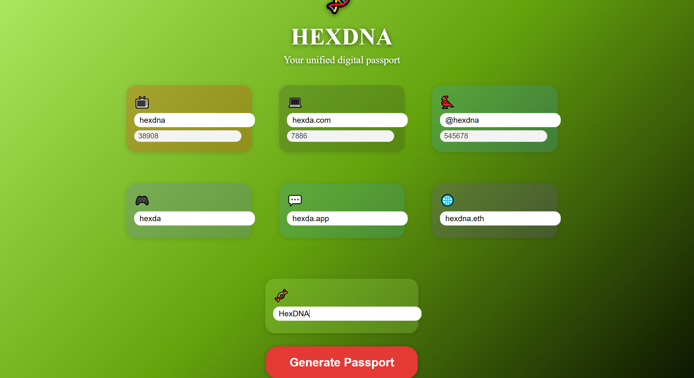
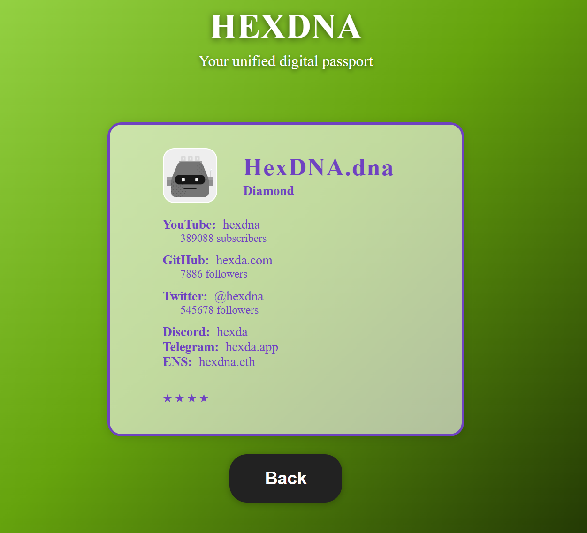

# HEXDNA

**HEXDNA** is your unified digital passport.  
Generate a unique digital identity card based on your social profiles and followers, with a personalized robot avatar.

## Features

- Enter your main social handles and follower counts.
- Get a unique, professional "passport" with a DiceBear robot avatar.
- Visual rank and stars based on your total followers.
- All data is local and private.

## Screenshots

### Main Form



### Passport Example



## How to use

1. Clone the repo:
   ```sh
   git clone https://github.com/Reaxtiv/HexDNA.git
   cd HexDNA
   ```
2. Install dependencies:
   ```sh
   npm install
   ```
3. Run locally:
   ```sh
   npm run dev
   ```
4. Open [http://localhost:3000](http://localhost:3000) in your browser.

## Tech Stack

- Next.js / React
- DiceBear Avatars API
- CSS

## License

MIT

---

**Made with ❤️ by [Reaxtiv](https://github.com/Reaxtiv)**